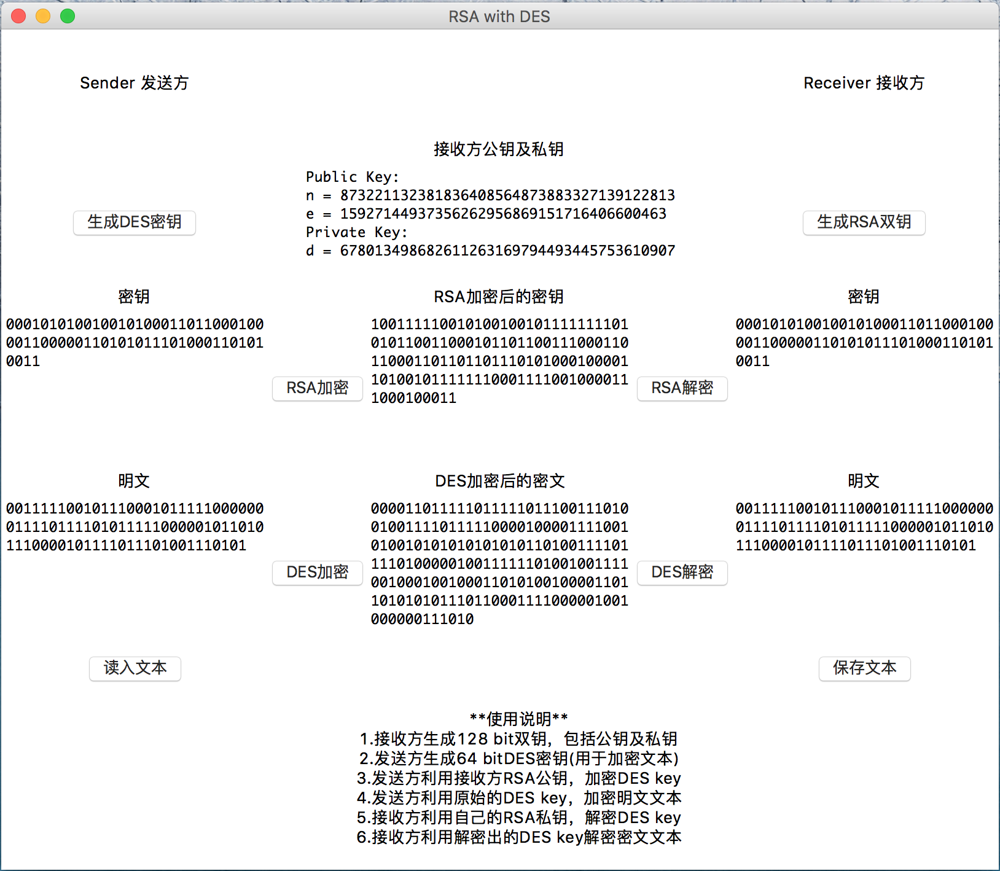

# RSA

RSA是一种非对称加密算法。

本程序用python3.4语言，实现了简单的RSA加解密算法，包括生成双钥等。

同时，把[RSA](https://github.com/irmowan/RSA)与[DES](https://github.com/irmowan/DES)结合，利用RSA公钥和私钥，传输DES密钥，模拟简单的加密通讯过程。

## 文件说明

- `Readme.md` 即为本内容，说明文档
- `dist/` 目录是在Windows下生成的可执行文件的目录
- `dist/RSA_GUI.exe` RSA的可执行文件
- `RSA_GUI.py` RSA的可视化版本源代码
- `RSA_Console.py ` RSA的命令行版本源代码
- `DES_Console.py` DES的命令行版本源代码，提供DES加解密接口
- `setup.py` 由python内置GUI生成exe的工具
- `Text.txt` 测试用文本，可用于输入、输出
- `GUIDemo.png` GUI程序的Demo图

## 运行方法

1. Windows平台下可以直接运行`dist`目录下的`DES_GUI.exe`可执行文件
2. Windows/Linux/Mac OS X平台下，在安装Python3.4后，可以在终端内输入命令`$python3 RSA_GUI.py`执行脚本
3. Windows/Linux/Mac OS X平台下，也可以使用命令行界面的版本，通过终端命令`$python3 RSA_Console.py`执行
4. 若需要打包为exe文件，安装py2exe扩展库后，在终端使用命令`$python3 setup.py py2exe`打包

## 使用步骤

1. 接收方生成RSA双钥，双钥会显示在文本框中
2. 发送方生成DES密钥，密钥会显示在左侧文本框中
3. 发送方利用接收方RSA公钥加密DES密钥，加密结果显示在中间文本框中
4. 发送方输入/载入明文文本，必须为二进制01串，且长度是8的倍数
5. 发送方利用生成的DES密钥，加密明文文本，得到的密文显示在中间文本框中
6. 接收方利用自己的RSA私钥解密DES密钥，解密结果显示在右侧文本框中
7. 接收方利用解密出的DES密钥，解密密文文本，得到原始明文

## 代码说明

- 该程序模拟了RSA加密和解密算法
- RSA生成两个64bit素数，继而得到128bit的密钥
- 素数生成使用**Miller-Rabin测试法**，生成速度为300个每秒。
- 64bit DES密钥采用**手动随机生成**的方式
- 该程序的DES加解密部分调用了[DES](https://github.com/irmowan/DES)模块，详细说明可参见DES程序
- DES加密时的64位IV为**随机产生**，因而加密结果每次均不同
- 明文补位以字节为单位，明文必须是8的倍数，否则报错
- 输入有错时，会输出相应的提示

## 用户界面

- 该程序的用户界面版本使用python的tkinter库编写
- 提供七个文本框，分别是RSA双钥、发送方DES密钥、DES加密后的密钥、接收方解密得到的DES密钥，以及明文文本、加密文本、接收方解密得到的明文文本
- 其中，**明文文本**是自行输入或载入，其它均为生成得到，或运行算法得到
- 文本输入为二进制字符串，也即连续的01字符串，其他输入均不合法，中途不得含有空格等其它字符
- 可以从指定文件中读入文本，或保存文本到指定文件中
- 界面最后提供了简单的操作步骤，可按操作步骤执行程序

## 加密测试

运行GUI程序，依据使用步骤，进行加解密测试。  

- 左侧为发送方，右侧为接收方
- 解密结果与刚刚输入的明文一致，加解密可逆 
- RSA加密结果唯一，DES加密结果不唯一，解密结果均不变
- 命令行会同步输出一些加解密的具体信息
- 尝试不同的输入进行测试，当输入文本、密钥位数不正确时，会输出适当的错误提示

---

Author: Irmo  

Date: 2015.11